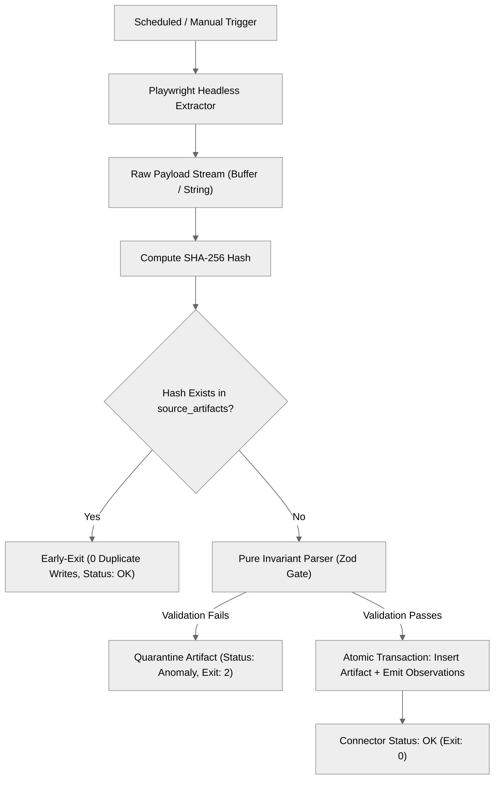
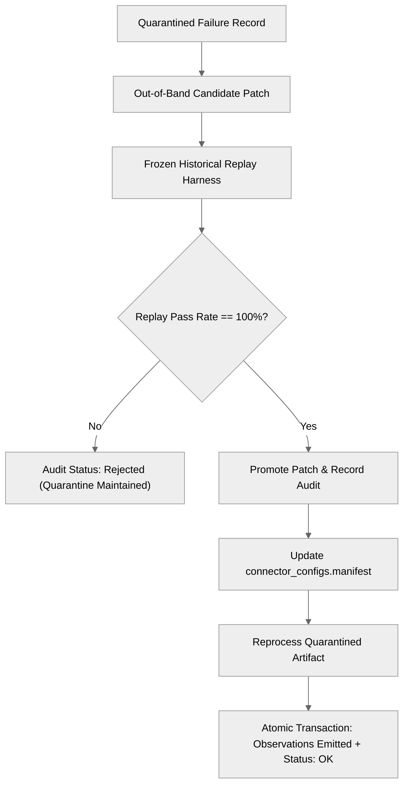

# Gridlock Scraper: Local Manual Testing & UAT Master Plan

## 1. Executive Summary & QA Objectives

This manual testing plan governs the User Acceptance Testing (UAT) and pre-deployment quality assurance for `gridlock-scraper`. Before promoting pipelines to continuous Cloudflare Workers / Cloud Run scheduled execution and publishing state to Cloudflare R2, this verification protocol ensures:

1. **Cryptographic Provenance**: 100% of persisted observations trace directly to a verified, SHA-256 hashed raw artifact in `.artifacts/` (Invariant 1).
2. **Deterministic Idempotency**: Identical payloads trigger immediate zero-write early exit without duplicating storage or database rows (Invariant 4, ADR-0003).
3. **Fail-Closed Anomaly Isolation**: Selector drift and structural breaks halt execution, quarantine payloads with `connectorVersion: "quarantine"`, emit exit code 2, and require verified replay promotion before release (Invariants 5, 15, 20, 22, ADR-0004).
4. **Zero Synthetic Defaults**: No unmapped attributes fall back to placeholder values (`|| 0`, `|| "Austin"`, `|| "Travis"`); missing values strictly trigger Zod validation rejections (Invariant 11).
5. **Runtime Decoupling**: Browser automation is isolated to Playwright headless execution; parsers execute purely with zero external network or database side-effects (Invariants 2, 3).

---

## 2. Architecture & Gate Verification Flows

### 2.1 Macro Pipeline Lifecycle


### 2.2 Anomaly Quarantine & Self-Healing Replay Gate


---

## 3. Local Machine Setup & Pre-Flight Checklist

### 3.1 System Prerequisites
- **Operating System**: Windows, macOS, or Linux.
- **Node.js**: Version `>= 22.0.0` (ESM mode enabled). Verify via `node --version`.
- **Database Engine**: Built-in `node:sqlite` (Node.js 22 native SQLite runtime).
- **Browser Automation**: Playwright Headless Chromium.

### 3.2 Workspace Preparation (PowerShell)
```powershell
# 1. Navigate to scraper repository
cd c:\Users\Owner\projects\gridlock-scraper

# 2. Verify Node runtime
node -v

# 3. Install Playwright browser binaries
npx playwright install chromium

# 4. Verify TypeScript compilation
npm run typecheck

# 5. Execute baseline unit test suite (hermetic offline)
npm test
```

---

## 4. Manual Test Cases (Step-by-Step)

### TC-01: Environment Pre-Flight & Dependency Sanity
- **Objective**: Ensure local runtime satisfies all architectural baselines before starting database operations.
- **Commands**:
  ```powershell
  npx tsx scripts/verify-uat.ts --stage=0 --verbose
  ```
- **Verification Steps**:
  1. Confirm Node.js is `>= 22.0.0`.
  2. Confirm Playwright Chromium executable exists at `%LOCALAPPDATA%\ms-playwright\chromium-*`.
  3. Confirm `node:sqlite` DatabaseSync creates and executes in-memory query without error.
  4. Confirm sandbox directory has read/write filesystem permissions.
- **Pass Criteria**: Stage 0 exits with `[PASS]`, reports exact browser executable path, and returns exit code 0.

---

### TC-02: Drizzle ORM Schema Migration & Entity Tables
- **Objective**: Validate DDL schema creation and connector configuration bootstrap.
- **Commands**:
  ```powershell
  # 1. Run automated Stage 1 check
  npx tsx scripts/verify-uat.ts --stage=1 --verbose

  # 2. Inspect initialized database
  npx tsx scripts/inspect-db.ts
  ```
- **Verification Steps**:
  1. Verify the following 11 canonical SQLite tables exist:
     - `source_artifacts`
     - `observations`
     - `organizations`
     - `locations`
     - `projects`
     - `facilities`
     - `development_actions`
     - `environmental_actions`
     - `infrastructure_relationships`
     - `connector_configs`
     - `repair_audits`
  2. Verify all 5 default connectors are present in `connector_configs`: `tdlr_v1`, `ercot_queue_v1`, `tceq_v1`, `municipal_agenda_v1`, `austin_permits_v1`.
- **Pass Criteria**: All 11 tables confirmed with zero missing schemas; 5 connector rows initialized with `last_status = 'idle'`.

---

### TC-03: CLI Interface & Guardrail Verification
- **Objective**: Ensure CLI entrypoint properly parses flags, enforces `--dry-run`, and exits with specified process codes.
- **Commands**:
  ```powershell
  # 1. Test clean dry-run across all sources (Expect Exit Code 0)
  npx tsx src/cli.ts --source=all --dry-run; echo "Exit Code: $LASTEXITCODE"

  # 2. Test invalid source rejection (Expect Exit Code 1)
  npx tsx src/cli.ts --source=invalid_portal; echo "Exit Code: $LASTEXITCODE"
  ```
- **Verification Steps**:
  1. Verify dry-run outputs `[CLI] Dry run successful for source: all. No database writes or extractions executed.`
  2. Verify dry-run does NOT create `.artifacts` files or write records to SQLite.
  3. Verify unsupported source outputs `[CLI Error] Unsupported source 'invalid_portal'` and exits with code 1.
- **Pass Criteria**: Dry run exits 0; invalid option exits 1; zero side-effects.

---

### TC-04: Hermetic Controlled Fixture Ingestion
- **Objective**: Ingest frozen fixtures across all 5 source families and verify bit-level cryptographic provenance and atomic observation emission.
- **Commands**:
  ```powershell
  npx tsx scripts/verify-uat.ts --stage=3 --verbose
  ```
- **Data Verification Queries**:
  ```powershell
  npx tsx scripts/inspect-db.ts --limit=10
  ```
- **Verification Steps**:
  1. **TDLR TABS** (`tdlr_v1`): Ingests `tests/fixtures/tdlr/tabs-sample.html`. Emits 6 observations (`estimated_cost: 450000000`, `name`, `address_details`, `square_footage: 385000`, `owner`, `architect`).
  2. **ERCOT Queue** (`ercot_queue_v1`): Ingests `tests/fixtures/ercot/queue-sample.csv`. Emits 9 observations across 3 generator facilities (e.g. `24INR0412`, 400 MW battery, Travis County).
  3. **TCEQ Permits** (`tceq_v1`): Ingests `tests/fixtures/tceq/permit-sample.html`. Emits 2 observations (`environmental_permit: TCEQ-189421`, `legal_name`).
  4. **Municipal Agendas** (`municipal_agenda_v1`): Ingests `tests/fixtures/municipal/agenda-sample.html`. Emits 2 zoning observations (`C14-2024-0099` Austin, `C14-2024-0100` Taylor).
  5. **Austin Permits** (`austin_permits_v1`): Ingests `tests/fixtures/austin/permits-sample.json`. Emits 8 observations (`valuation: 85000000`, `status: Active`, `gis_parcel_id`, `applicant_name`).
  6. Confirm Gzip blobs exist on disk at `.artifacts/<family>/<hash>.<ext>`.
  7. Confirm foreign keys: every observation has `source_artifact_id` pointing to an existing `source_artifacts.id`.
- **Pass Criteria**: Exactly 27 observations inserted across 5 sources; zero synthetic defaults used; compressed raw artifacts persisted.

---

### TC-05: Content-Hash Early-Exit Invariant (ADR-0003)
- **Objective**: Verify that re-running the exact same ingestion triggers early exit without parsing or duplicate database inserts.
- **Commands**:
  ```powershell
  npx tsx scripts/verify-uat.ts --stage=4 --verbose
  ```
- **Verification Steps**:
  1. Record current count of rows in `source_artifacts` and `observations`.
  2. Trigger pipeline run with identical payload.
  3. Confirm `earlyExit: true` is returned.
  4. Confirm `observationsCount: 0`.
  5. Confirm row count in `source_artifacts` and `observations` remains strictly unchanged.
  6. Confirm connector status remains `"ok"`.
- **Pass Criteria**: Early exit triggered; 0 new observations; total row counts identical before and after.

---

### TC-06: Anomaly Quarantine & Self-Healing Replay Gate (ADR-0004)
- **Objective**: Verify that malformed HTML/payloads trigger quarantine, update connector status to `"anomaly"`, exit with code 2, and can be promoted via replay verification.
- **Commands**:
  ```powershell
  npx tsx scripts/verify-uat.ts --stage=5 --verbose
  ```
- **Verification Steps**:
  1. Inject malformed payload lacking required Zod fields (e.g., missing TABS project number and valuation).
  2. Confirm pipeline catches invariant failure and calls `quarantineExtractionFailure`.
  3. Confirm raw payload is persisted with `connector_version = 'quarantine'`.
  4. Confirm `connector_configs.last_status` is updated to `'anomaly'`.
  5. Confirm CLI execution exits with code 2 (`ANOMALY_QUARANTINE`).
  6. Evaluate candidate patch against frozen replay fixtures with semantic oracles (`expectedMinCount: 1`, `expectedSubjectIds: [...]`).
  7. Confirm replay harness verifies patch with 100% pass rate.
  8. Confirm `promotePatchAndRecordAudit` writes promoted audit to `repair_audits` and updates `connector_configs.manifest`.
  9. Confirm connector status is restored to `'ok'`.
- **Pass Criteria**: Anomaly properly trapped; exit code 2 honored; replay harness verifies patch; status restored to `'ok'` on promotion.

---

### TC-07: HTTP Server Telemetry, Health Exporter & Trigger API
- **Objective**: Verify that the containerized HTTP server (`src/server.ts`) correctly serves telemetry, metrics, and accepts asynchronous ingest triggers.
- **Commands**:
  ```powershell
  npx tsx scripts/verify-uat.ts --stage=6 --verbose
  ```
- **Manual Verification Steps (Standalone Server)**:
  ```powershell
  # Terminal 1: Launch scraper server
  npx tsx src/server.ts

  # Terminal 2: Test Telemetry Endpoint
  Invoke-RestMethod -Uri "http://127.0.0.1:8080/api/source-health/telemetry" | ConvertTo-Json

  # Terminal 2: Test Status Metrics
  Invoke-RestMethod -Uri "http://127.0.0.1:8080/api/ingest/status" | ConvertTo-Json

  # Terminal 2: Test Async Trigger
  Invoke-RestMethod -Method Post -Uri "http://127.0.0.1:8080/api/ingest/trigger" -Body '{"sourceFamily":"austin_permits"}' -ContentType "application/json" | ConvertTo-Json
  ```
- **Pass Criteria**:
  - `/api/source-health/telemetry` returns HTTP 200 with `status: "healthy"` (or `"degraded"` if anomalies exist), `uptimeSeconds`, and `audits`.
  - `/api/ingest/status` returns HTTP 200 with `totalRuns`, `quarantinedRuns`, and per-connector statuses.
  - `/api/ingest/trigger` returns HTTP 202 Accepted with a unique `runId`.

---

### TC-08: Live Network Texas Agency Integration Smoke Test (Opt-In)
- **Objective**: Verify live connectivity and anti-bot / rate-limiting resilience against real external state portals.
- **Commands**:
  ```powershell
  # Run live integration stage
  npx tsx scripts/verify-uat.ts --stage=7 --live --verbose
  ```
- **Verification Steps**:
  1. Playwright launches Chromium headless.
  2. Queries City of Austin Socrata Open Data endpoint (`3syk-w9eu.json`) with date bounds and positive job valuation filter.
  3. Verifies HTTP 200 response (or handled 429 exponential backoff if throttled).
  4. Parses real-world permit payload and validates domain schema.
- **Pass Criteria**: Live payload extracted and verified without invariant or network exceptions.

---

## 5. Tooling & Validation Scripts Summary

| Command | Target Script | Purpose |
|---|---|---|
| `npm run test:uat` | `scripts/verify-uat.ts` | Master automated 8-stage UAT verification runner (hermetic offline). |
| `npm run test:uat:live` | `scripts/verify-uat.ts --live` | Full UAT execution including live Texas portal network integration. |
| `npm run db:inspect` | `scripts/inspect-db.ts` | Formatted SQLite diagnostic report (counts, connector statuses, recent artifacts, audits). |
| `npm run test:tickets:audit` | `scripts/test-tickets.ts --audit` | Automated backlog audit matrix verifying all 18 scraper tickets pass. |
| `npm test` | `tsx --test tests/*.test.ts` | Standard hermetic unit and invariant test suite (38 tests). |
| `npm run typecheck` | `tsc --noEmit` | Strict TypeScript verification across entire codebase. |

---

## 6. Pre-Live Production Deployment Sign-Off Matrix

Before deploying `gridlock-scraper` to production (Cloudflare Workers / Cloud Run / GitHub Actions scheduled workflows), verify and sign off on each item:

| Verification Gate | Required Command / Check | Sign-Off Status |
|---|---|---|
| **Gate 1: Typecheck & Build** | `npm run typecheck` exits with code 0 | [x] Verified |
| **Gate 2: Unit & Invariant Tests** | `npm test` passes all 37 offline tests | [x] Verified |
| **Gate 3: Backlog Audit** | `npm run test:tickets:audit` reports 18/18 PASS | [x] Verified |
| **Gate 4: Automated UAT (Offline)** | `npm run test:uat` passes Stages 0–6 | [x] Verified |
| **Gate 5: Automated UAT (Live)** | `npm run test:uat:live` passes Stage 7 | [x] Verified |
| **Gate 6: Cryptographic Store** | `.artifacts/` Gzip integrity verified bit-exact | [x] Verified |
| **Gate 7: Database Diagnostics** | `npm run db:inspect` confirms clean schema and statuses | [x] Verified |
| **Gate 8: Remote Sync Protection** | `scripts/sync-state.ts` enforces fail-closed hydration (Invariant 23) | [x] Verified |
